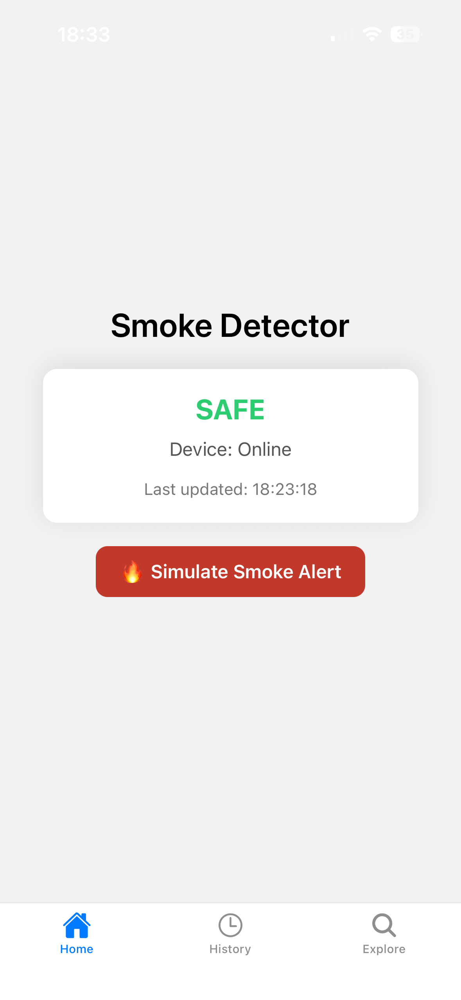
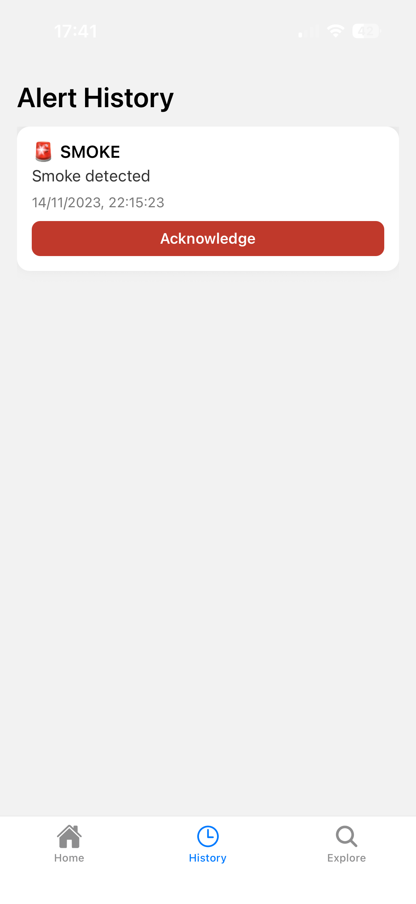
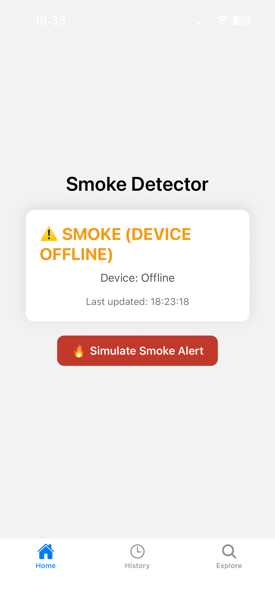
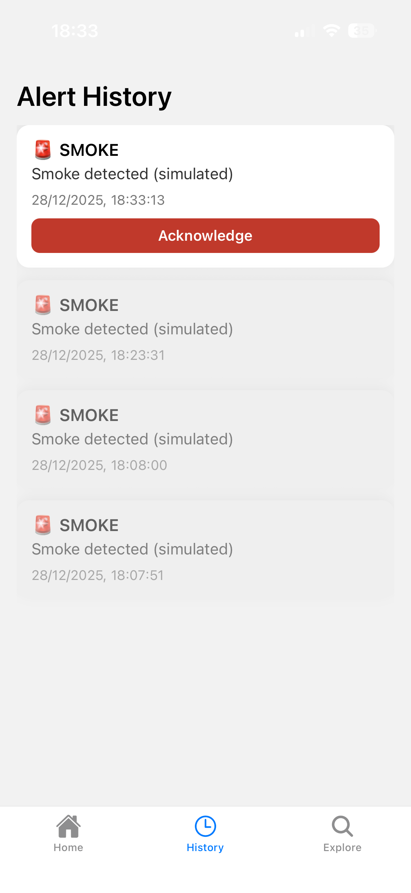
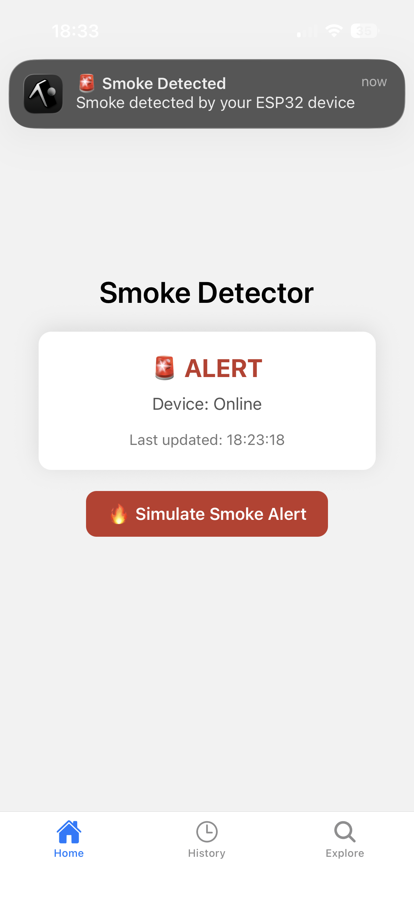

# ESP32 Smoke Detector – IoT & Mobile System

A real-time **IoT smoke detection system** combining an ESP32 device with a **React Native (Expo) mobile application**, backed by **Firebase Realtime Database**.

This project demonstrates practical skills in **IoT architecture**, **real-time systems**, **mobile development**, and **cloud-based state synchronization**, with a strong focus on reliability, testability, and clean system design.

---

## 🧠 Why This Project Matters

This project was built to mirror **real-world engineering constraints**:

- Hardware is unreliable → the system is designed to tolerate offline states  
- Alerts must persist → history survives app restarts  
- UI must reflect live state → real-time data streams  
- Hardware may arrive late → system remains testable without it  

To achieve this, the system was designed so the **mobile app and backend could be fully implemented and validated before physical hardware was available**.

---

## 🚀 Key Features

### 📱 Mobile Application (React Native + Expo)
- Real-time smoke status monitoring
- Device online / offline detection
- Persistent alert history
- Alert acknowledgement (silencing)
- Live updates via Firebase Realtime Database listeners
- Push notifications on smoke detection
- Clean, safety-focused UI

### 🔥 Alert Lifecycle
- Smoke events are written once and persisted
- Alerts remain visible after app restarts
- Alerts can be acknowledged and visually distinguished
- History reflects the full timeline of events

### 🧪 Hardware Simulation (Engineering Best Practice)
- A simulated ESP32 alert writer is built into the app
- Uses the **exact same data format** as the real device
- Enables full end-to-end testing without hardware
- Can be removed later with zero UI changes

### 🔌 ESP32 Integration (In Progress)
- Smoke sensor input
- Buzzer / alarm output
- Wi-Fi connectivity
- Writes alerts directly to Firebase RTDB
- Listens for remote control commands (e.g. alarm disable)

---

## 📸 Screenshots

### Home – Live Device Status

| Safe | Smoke Alert | Device Offline |
|------|------------|----------------|
|  |  |  |

*The home screen updates instantly based on smoke detection and device connectivity.*

---

### Alert History



*All alerts are persisted in Firebase and displayed chronologically.*

---

### Push Notifications



*Immediate user notification when smoke is detected.*

---

## 🧩 System Architecture

```
ESP32 Device (or Simulator)
│
│ (Wi-Fi / HTTPS)
▼
Firebase Realtime Database
│
├── Realtime Trigger
│ ▼
│ Cloud Functions (v2)
│ ├─ sendSmokeAlert
│ │ ├─ Rising-edge smoke detection
│ │ ├─ Alert persistence
│ │ └─ Push notification dispatch
│ │
│ └─ checkDeviceOffline (Scheduled)
│ ├─ Runs every 1 minute
│ ├─ Heartbeat validation
│ └─ Backend-enforced offline detection
│
▼
React Native Mobile App (Expo)
│
├─ Live device status
├─ Alert history
└─ Push notifications
```
**Design principles:**
- ESP32 is the **source of truth** for smoke events  
- Firebase RTDB is the **shared real-time state layer**  
- Cloud Functions enforce **backend reliability**  
- Offline detection is **not device-trusted**  
- UI reflects **server-validated state only**  
- Hardware and UI remain **loosely coupled**

---

## 📂 Project Structure
```
ESP32-smoke-detector-iot/
├─ README.md # Project overview (this file)
├─ screenshots/ # UI screenshots for documentation
│ ├─ home-safe.png
│ ├─ home-alert.png
│ ├─ home-offline.png
│ ├─ history-alerts.png
│ └─ notification.png
├─ app/
│ ├─ (tabs)/
│ │ ├─ index.tsx # Home / live status
│ │ ├─ history.tsx # Alert history
│ │ └─ explore.tsx
│ ├─ lib/
│ │ └─ mockAlerts.ts # Simulated ESP32 (dev/testing)
│ └─ firebase.ts # Firebase configuration
├─ esp32/ # ESP32 firmware (In progress)
├─ functions/
│ ├─ src/
│ │ └─ index.ts # Cloud Functions (alerts + offline detection)
│ └─ package.json
└─ (functions/lib is intentionally gitignored)


```
---
## 🧪 Testing Strategy

The system was intentionally designed so **hardware is not required to validate correctness**:

- Smoke alerts can be simulated directly in the app
- Database writes and listeners are tested end-to-end
- UI state changes are verified in real time
- Alert acknowledgement flow is validated independently

This reduces debugging complexity and mirrors how real IoT systems are developed and tested.

---

## 🔐 Firebase Data Model

```json
{
  "devices": {
    "device1": {
      "online": true,
      "smoke": false,
      "lastUpdated": 1700000000
    }
  },
  "alerts": {
    "-alertId": {
      "deviceId": "device1",
      "type": "SMOKE",
      "message": "Smoke detected",
      "active": true,
      "timestamp": 1700000000
    }
  }
}
```

## 🛠 Technologies Used
- ESP32 (Arduino framework)
- React Native (Expo)
- Firebase Realtime Database
- Expo Push Notifications
- TypeScript
- Git & GitHub
- Firebase Cloud Functions (v2)
- Cloud Scheduler


## 🧭 Future Improvements
- ESP32 hardware deployment
- Remote alarm enable / disable from mobile app
- Multi-device support
- Alert severity levels
- Offline push notifications
- Alert auto-resolution
- Secure Firebase RTDB rules


## 🏷️ Versioning

- **v1.0.0**
  - Smoke detection via ESP32 / simulator
  - Persistent alert lifecycle
  - Push notifications
  - Backend offline detection (Cloud Scheduler)
  - Firebase Functions v2


## ⚠️ Disclaimer
This project is for educational and experimental purposes only and is not a certified safety device.
It should not be used as a replacement for approved smoke detectors.

## 👤 Author

**Mario Andrus**   
Computer Science Student   
Interests: IoT Systems, Mobile Development, Cloud & Real-Time Applications, Software Development, Cyber Security